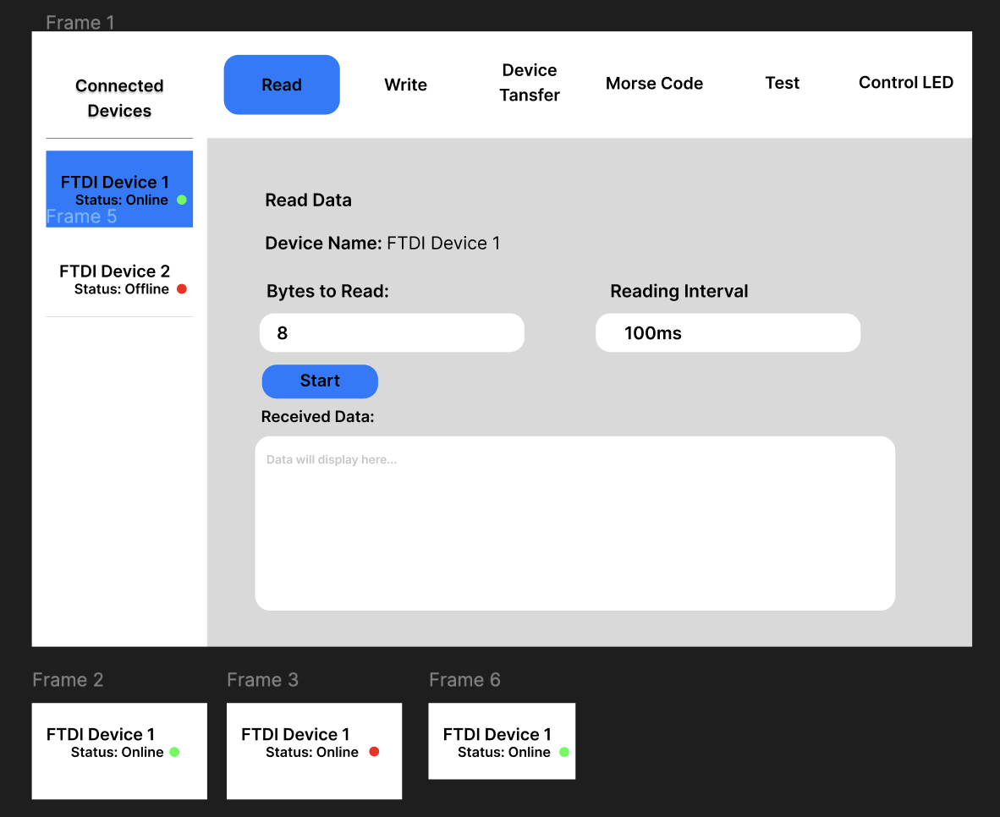

# Oscilloscope-Function-Generator

## Overview
This project demonstrates how to communicate with **FTDI USB devices** using the **FTD2XX driver** in C++.  
It provides object-oriented abstractions for reading and writing data to FTDI devices and includes a simple
command-line interface for testing and interaction.

The program allows you to:
- Initialize and configure FTDI devices.
- Send and receive data using `FTDWriter` and `FTDReader`.
- Run a **Driver Test** that reads one byte from an input file and writes it to an output file.

---

## Features

- **Device Initialization**: Opens, resets, purges, and configures FTDI devices.
- **Encapsulated I/O**:
  - `FTDWriter` — sends bytes to the device.
  - `FTDReader` — reads bytes from the device.
- **Error Handling**: Uses C++ exceptions for clean error reporting.
- **Driver Test Mode**:
  - Reads one byte from a file (`input.txt`).
  - Writes it through the FTDI device (simulated if only one handle is used).
  - Saves the result to an output file (`output.txt`).

---
## Build Instructions

Make sure the **FTDI D2XX library** is installed and available as `libftd2xx.a`. 

### macOS

You can then compile with: 
```make ``` 

Then run: 
```./main```

## Running the Program

When executed, the menu looks like this:

```
Control Menu:
- 1. Control LEDs
- 2. Send Morse Code
- 3. Write byte to port
- 4. Read byte from port
- 5. Driver Test
- 6. Exit
Enter your choice:
``` 


## Driver Test

The **Driver Test** performs a simulated transfer:

1. Reads **1 byte** from `input.txt`.
2. Writes it through the FTDI device (using the same handle if only one device is present).
3. Writes that byte to `output.txt`.

### Creating Raw Input Files

The Driver Test expects a **binary file**, not plain text.

#### On macOS / Linux:
```bash
printf "\xFF" > input.txt
```
You can replace "FF" with any other byte such as "00" or "F0"
### Verifying the Output

After running the Driver Test, you can check that the byte was successfully written to `output.txt`.

#### On macOS / Linux:
Use the `xxd` command to display the file contents in hexadecimal:

```bash
xxd output.txt

## Figma Design

A simple Figma mockup illustrates the interface and flow of the **Oscilloscope-Function-Generator** application.

You can view the design here:  
👉 [**View Figma Design**](https://www.figma.com/design/vYemvnTYgpOh9eQVtW2I5X/Osciloscope?node-id=0-1&p=f&t=51dGk6KWzvfs07sf-0)

### Preview



